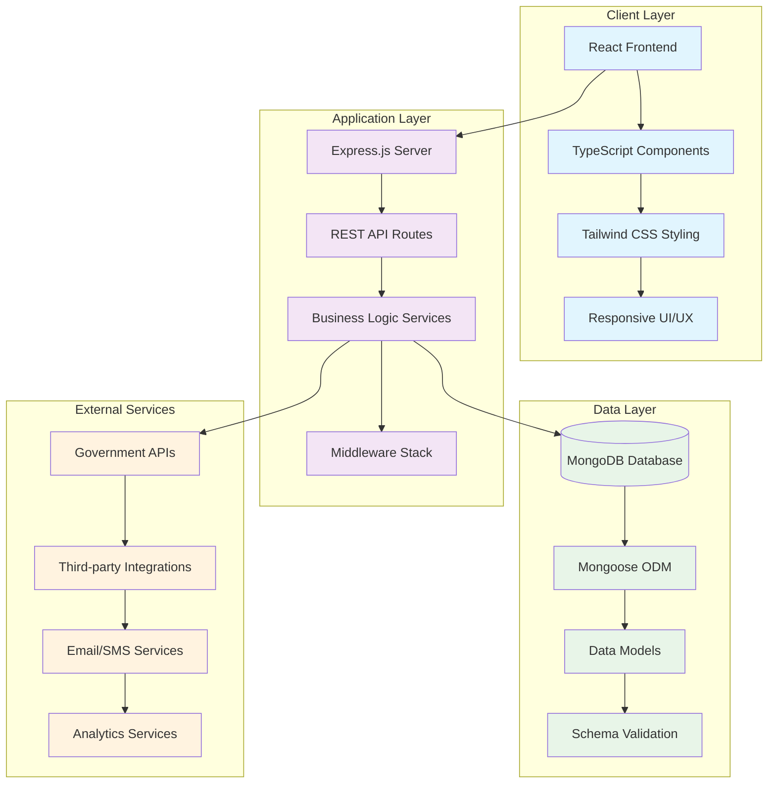
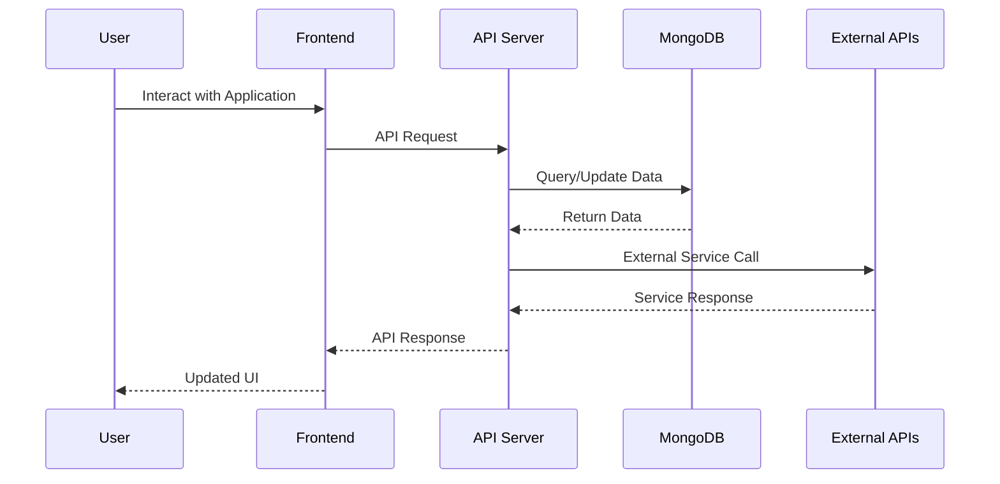

# LaunchMate

## A Unified Startup Launch & Compliance Assistant for Delhi Entrepreneurs

[](https://opensource.org/licenses/MIT)
[](https://nodejs.org/)
[](https://reactjs.org/)
[](https://www.typescriptlang.org/)
[](https://expressjs.com/)
[](https://www.mongodb.com/)

> Empowering entrepreneurs and teams to launch with confidence, community, and comprehensive tools for navigating startup compliance and approvals in Delhi.

---

## Table of Contents

- [About LaunchMate](#about-launchmate)
- [Key Features](#key-features)
- [System Architecture](#system-architecture)
- [Technology Stack](#technology-stack)
- [Project Structure](#project-structure)
- [Getting Started](#getting-started)
- [Configuration](#configuration)
- [API Documentation](#api-documentation)
- [Testing](#testing)
- [Deployment](#deployment)
- [Contributing](#contributing)
- [Troubleshooting](#troubleshooting)
- [License](#license)
- [Team](#team)

---

## About LaunchMate

LaunchMate is a comprehensive digital platform designed specifically for Delhi-based entrepreneurs and startups to streamline their launch process and ensure regulatory compliance. The platform addresses the critical challenges faced by 90% of startups that fail due to poor launch execution and compliance issues.

### Our Mission
To democratize startup success by providing structured guidance, automated compliance tracking, and community-driven support for entrepreneurs navigating the complex regulatory landscape of Delhi's business ecosystem.

### Target Audience
- **Startup Founders** launching their first venture in Delhi
- **Product Managers** coordinating complex product releases
- **Development Teams** seeking structured launch processes
- **Business Consultants** managing multiple client launches
- **Incubators & Accelerators** supporting portfolio companies

---

## Key Features

### Launch Management Suite
- **Smart Launch Checklists**: AI-powered, industry-specific launch sequences tailored for Delhi market
- **Timeline Management**: Visual project timelines with milestone tracking and deadline alerts
- **Task Automation**: Automated reminders and workflow triggers for critical launch activities
- **Progress Analytics**: Real-time launch progress dashboards with KPI tracking
- **Risk Assessment**: Early identification and mitigation of potential launch risks

### Compliance & Regulatory Tools
- **Approval Tracker**: Monitor status of government approvals, licenses, and permits
- **Compliance Calendar**: Automated reminders for regulatory deadlines and renewals
- **Document Generator**: Pre-filled templates for common regulatory documents
- **Scheme Recommender**: AI-powered recommendations for relevant government schemes
- **Setup Wizard**: Step-by-step guidance through Delhi startup registration process

### AI-Powered Assistant
- **Smart Recommendations**: Personalized suggestions based on industry and business model
- **Compliance Checker**: Automated verification of document completeness and accuracy
- **Market Analysis**: Data-driven insights on Delhi market trends and opportunities
- **Success Prediction**: Launch success probability based on historical data
- **24/7 Support**: AI chatbot for instant queries and guidance

### Multi-language Support
- **Hindi & English**: Fully localized interface for better accessibility
- **Cultural Adaptation**: Delhi-specific business context and terminology
- **Regional Compliance**: State-specific regulatory requirements and processes

### Analytics & Reporting
- **Launch Metrics Dashboard**: Track user acquisition, growth metrics, and ROI
- **Compliance Reports**: Generate reports for investor meetings and regulatory submissions
- **Performance Analytics**: Monitor platform usage and engagement metrics
- **Export Capabilities**: PDF/Excel export for all reports and data

---

## System Architecture



### Data Flow Architecture



---

## Technology Stack

### Frontend Technologies
| Technology | Version | Purpose |
|------------|---------|---------|
| **React** | 18.x | Frontend framework for building user interfaces |
| **TypeScript** | 5.x | Type-safe JavaScript for better development experience |
| **Vite** | 5.x | Fast build tool and development server |
| **Tailwind CSS** | 3.x | Utility-first CSS framework for styling |
| **React Router** | 6.x | Client-side routing for single-page application |
| **Lucide React** | Latest | Modern icon library for React components |
| **React Context API** | Built-in | State management for themes, language, and app data |

### Backend Technologies
| Technology | Version | Purpose |
|------------|---------|---------|
| **Node.js** | 18.x | JavaScript runtime for server-side development |
| **Express.js** | 4.x | Web application framework for Node.js |
| **MongoDB** | 6.x | NoSQL database for flexible data storage |
| **Mongoose** | 8.x | MongoDB object modeling for Node.js |
| **JWT** | Latest | JSON Web Tokens for secure authentication |
| **Bcrypt** | Latest | Password hashing for security |

### Development Tools
| Tool | Purpose |
|------|---------|
| **ESLint** | Code linting and quality assurance |
| **PostCSS** | CSS processing and optimization |
| **Vite Config** | Build configuration and optimization |
| **TypeScript Config** | Type checking and compilation settings |

---

## Project Structure

```
launchmate/
├── backend/                    # Node.js/Express backend server
│   ├── models/                 # MongoDB data models
│   │   └── Subscriber.js       # Newsletter subscriber model
│   ├── routes/                 # API route handlers
│   │   └── subscribe.js        # Newsletter subscription routes
│   ├── server.js               # Main server entry point
│   ├── package.json            # Backend dependencies
│   └── package-lock.json       # Dependency lock file
│
├── frontend/                   # React/TypeScript frontend
│   ├── public/                 # Static assets
│   │   └── assets/
│   │       └── logo.png        # Application logo
│   │
│   ├── src/                    # Source code directory
│   │   ├── components/         # Reusable React components
│   │   │   ├── Layout/         # Layout components
│   │   │   │   ├── Footer.tsx   # Application footer
│   │   │   │   ├── Header.tsx   # Navigation header
│   │   │   │   └── Layout.tsx   # Main layout wrapper
│   │   │   ├── UI/             # UI component library
│   │   │   │   ├── Button.tsx   # Custom button component
│   │   │   │   ├── Card.tsx     # Card container component
│   │   │   │   ├── ProgressBar.tsx # Progress indicator
│   │   │   │   ├── Toast.tsx    # Toast notification
│   │   │   │   └── ToastContainer.tsx # Toast manager
│   │   │   └── NewsletterForm.js # Newsletter subscription form
│   │   │
│   │   ├── contexts/           # React Context providers
│   │   │   ├── AppContext.tsx   # Global application state
│   │   │   ├── DataManagementContext.tsx # Data management
│   │   │   ├── LanguageContext.tsx # Internationalization
│   │   │   └── ThemeContext.tsx # Theme management
│   │   │
│   │   ├── i18n/               # Internationalization
│   │   │   ├── locales/        # Language files
│   │   │   │   ├── en.json      # English translations
│   │   │   │   └── hi.json      # Hindi translations
│   │   │   └── index.ts        # i18n configuration
│   │   │
│   │   ├── pages/              # Application pages/screens
│   │   │   ├── AIAssistant.tsx  # AI-powered assistant
│   │   │   ├── ApprovalTracker.tsx # Government approval tracker
│   │   │   ├── ComplianceCalendar.tsx # Regulatory calendar
│   │   │   ├── Contact.tsx      # Contact information
│   │   │   ├── Dashboard.tsx    # Main dashboard
│   │   │   ├── DocumentGenerator.tsx # Document templates
│   │   │   ├── Landing.tsx      # Landing page
│   │   │   ├── SchemeRecommender.tsx # Government schemes
│   │   │   ├── SetupWizard.tsx  # Startup setup guide
│   │   │   └── Support.tsx      # Help and support
│   │   │
│   │   ├── App.tsx             # Root application component
│   │   ├── main.tsx            # Application entry point
│   │   ├── index.css           # Global CSS styles
│   │   └── vite-env.d.ts       # Vite environment types
│   │
│   ├── index.html              # HTML template
│   ├── package.json            # Frontend dependencies
│   ├── package-lock.json       # Dependency lock file
│   ├── eslint.config.js        # ESLint configuration
│   ├── postcss.config.js       # PostCSS configuration
│   ├── tailwind.config.js      # Tailwind CSS configuration
│   ├── tsconfig.json           # TypeScript configuration
│   ├── tsconfig.app.json       # App-specific TypeScript config
│   ├── tsconfig.node.json      # Node.js TypeScript config
│   └── vite.config.ts          # Vite build configuration
│
├── .gitignore                  # Git ignore rules
├── LICENSE                     # MIT license file
└── README.md                   # Project documentation
```

---

## Getting Started

### Prerequisites

Before you begin, ensure you have the following installed on your system:

- **Node.js** (v18.0.0 or higher) - [Download](https://nodejs.org/)
- **MongoDB** (v6.0 or higher) - [Installation Guide](https://docs.mongodb.com/manual/installation/)
- **npm** (v9.0.0 or higher) - Comes with Node.js
- **Git** - [Download](https://git-scm.com/)

### Installation

1. **Clone the repository**
   ```bash
   git clone https://github.com/abhinav-phi/launchmate.git
   cd launchmate
   ```

2. **Install Backend Dependencies**
   ```bash
   cd backend
   npm install
   cd ..
   ```

3. **Install Frontend Dependencies**
   ```bash
   cd frontend
   npm install
   cd ..
   ```

4. **Environment Configuration**
   
   Create environment files for both backend and frontend:

   **Backend (.env in backend/ directory):**
   ```env
   # Database Configuration
   MONGODB_URI=mongodb://localhost:27017/launchmate
   MONGODB_TEST_URI=mongodb://localhost:27017/launchmate_test
   
   # Server Configuration
   PORT=5000
   NODE_ENV=development
   
   # JWT Configuration
   JWT_SECRET=your-super-secure-jwt-secret-key-change-in-production
   JWT_EXPIRE=7d
   
   # Email Configuration (for newsletter)
   SMTP_HOST=your-smtp-host
   SMTP_PORT=587
   SMTP_USER=your-email@example.com
   SMTP_PASS=your-email-password
   
   # API Keys (if using external services)
   GOVERNMENT_API_KEY=your-government-api-key
   GOOGLE_MAPS_API_KEY=your-google-maps-api-key
   ```

   **Frontend (.env in frontend/ directory):**
   ```env
   # API Configuration
   VITE_API_BASE_URL=http://localhost:5000/api
   
   # Application Configuration
   VITE_APP_NAME=LaunchMate
   VITE_APP_VERSION=1.0.0
   
   # Feature Flags
   VITE_ENABLE_ANALYTICS=true
   VITE_ENABLE_NOTIFICATIONS=true
   ```

5. **Database Setup**
   ```bash
   # Start MongoDB service
   # On macOS with Homebrew:
   brew services start mongodb-community
   
   # On Ubuntu/Debian:
   sudo systemctl start mongod
   
   # On Windows:
   net start MongoDB
   ```

### Running the Application

1. **Start the Backend Server**
   ```bash
   cd backend
   npm run dev
   ```
   Backend will be available at: `http://localhost:5000`

2. **Start the Frontend Development Server**
   ```bash
   cd frontend
   npm run dev
   ```
   Frontend will be available at: `http://localhost:5173`

3. **Access the Application**
   
   Open your browser and navigate to:
   - **Frontend**: http://localhost:5173
   - **Backend API**: http://localhost:5000/api

### Available Scripts

**Backend Scripts:**
```bash
npm run dev          # Start development server with hot reload
npm start            # Start production server
npm run test         # Run test suites
npm run lint         # Run ESLint for code quality
```

**Frontend Scripts:**
```bash
npm run dev          # Start Vite development server
npm run build        # Build for production
npm run preview      # Preview production build
npm run lint         # Run ESLint for code quality
npm run type-check   # Run TypeScript type checking
```

---

## Configuration

### Frontend Configuration

**Vite Configuration (vite.config.ts):**
```typescript
import { defineConfig } from 'vite'
import react from '@vitejs/plugin-react'

export default defineConfig({
  plugins: [react()],
  server: {
    port: 5173,
    host: true,
    proxy: {
      '/api': {
        target: 'http://localhost:5000',
        changeOrigin: true,
        secure: false,
      },
    },
  },
  build: {
    outDir: 'dist',
    sourcemap: true,
  },
})
```

**Tailwind Configuration (tailwind.config.js):**
```javascript
/** @type {import('tailwindcss').Config} */
export default {
  content: [
    "./index.html",
    "./src/**/*.{js,ts,jsx,tsx}",
  ],
  theme: {
    extend: {
      colors: {
        primary: {
          50: '#eff6ff',
          500: '#3b82f6',
          600: '#2563eb',
          700: '#1d4ed8',
        },
        success: '#10b981',
        warning: '#f59e0b',
        error: '#ef4444',
      },
      fontFamily: {
        sans: ['Inter', 'system-ui', 'sans-serif'],
      },
    },
  },
  plugins: [],
}
```

### Backend Configuration

**MongoDB Connection:**
```javascript
const mongoose = require('mongoose');

const connectDB = async () => {
  try {
    const conn = await mongoose.connect(process.env.MONGODB_URI, {
      useNewUrlParser: true,
      useUnifiedTopology: true,
    });
    console.log(`MongoDB Connected: ${conn.connection.host}`);
  } catch (error) {
    console.error('Database connection error:', error);
    process.exit(1);
  }
};
```

### Internationalization Setup

**i18n Configuration:**
```typescript
import { createContext, useContext } from 'react';

interface LanguageContextType {
  language: 'en' | 'hi';
  setLanguage: (lang: 'en' | 'hi') => void;
  t: (key: string) => string;
}

export const LanguageContext = createContext<LanguageContextType | undefined>(undefined);

export const useLanguage = () => {
  const context = useContext(LanguageContext);
  if (!context) {
    throw new Error('useLanguage must be used within a LanguageProvider');
  }
  return context;
};
```

---

## API Documentation

### Authentication Endpoints

| Method | Endpoint | Description | Request Body |
|--------|----------|-------------|--------------|
| POST | `/api/auth/register` | User registration | `{ email, password, name, phone }` |
| POST | `/api/auth/login` | User login | `{ email, password }` |
| POST | `/api/auth/logout` | User logout | None |
| GET | `/api/auth/profile` | Get user profile | None (requires token) |
| PUT | `/api/auth/profile` | Update user profile | `{ name, phone, company }` |
| POST | `/api/auth/forgot-password` | Request password reset | `{ email }` |
| POST | `/api/auth/reset-password` | Reset password | `{ token, password }` |

### Newsletter Endpoints

| Method | Endpoint | Description | Request Body |
|--------|----------|-------------|--------------|
| POST | `/api/subscribe` | Newsletter subscription | `{ email, name? }` |
| GET | `/api/subscribers` | Get all subscribers (admin) | None |
| DELETE | `/api/subscribe/:email` | Unsubscribe | None |

### Compliance Endpoints

| Method | Endpoint | Description | Request Body |
|--------|----------|-------------|--------------|
| GET | `/api/approvals` | Get approval status | None |
| POST | `/api/approvals` | Create approval tracker | `{ type, description, deadline }` |
| PUT | `/api/approvals/:id` | Update approval status | `{ status, notes }` |
| GET | `/api/schemes` | Get recommended schemes | `{ industry, revenue, employees }` |
| GET | `/api/documents` | Get document templates | `{ type }` |

### Analytics Endpoints

| Method | Endpoint | Description | Request Body |
|--------|----------|-------------|--------------|
| GET | `/api/analytics/dashboard` | Get dashboard metrics | None |
| GET | `/api/analytics/compliance` | Compliance analytics | None |
| POST | `/api/analytics/events` | Track user events | `{ event, properties }` |

### API Response Format

**Success Response:**
```json
{
  "success": true,
  "data": {
    // Response data
  },
  "message": "Operation completed successfully"
}
```

**Error Response:**
```json
{
  "success": false,
  "error": {
    "code": "ERROR_CODE",
    "message": "Human-readable error message",
    "details": "Additional error details"
  }
}
```

### Authentication

The API uses JWT (JSON Web Tokens) for authentication. Include the token in the Authorization header:

```javascript
headers: {
  'Authorization': `Bearer ${token}`,
  'Content-Type': 'application/json'
}
```

---

## Testing

### Testing Strategy

Our testing approach ensures reliability and maintainability:

- **Unit Tests**: Test individual components and functions
- **Integration Tests**: Test API endpoints and database interactions
- **End-to-End Tests**: Test complete user workflows
- **Performance Tests**: Test application performance under load

### Running Tests

**Backend Tests:**
```bash
cd backend
npm test                    # Run all tests
npm run test:watch         # Run tests in watch mode
npm run test:coverage      # Generate coverage report
npm run test:integration   # Run integration tests only
```

**Frontend Tests:**
```bash
cd frontend
npm test                   # Run all tests
npm run test:watch        # Run tests in watch mode
npm run test:coverage     # Generate coverage report
npm run test:e2e          # Run end-to-end tests
```

### Test Coverage Goals

- **Unit Tests**: 90%+ code coverage
- **Integration Tests**: All API endpoints tested
- **E2E Tests**: Critical user paths covered
- **Performance Tests**: Load testing for key features

### Test Examples

**Backend Unit Test:**
```javascript
describe('Subscriber Model', () => {
  test('should create a new subscriber', async () => {
    const subscriberData = {
      email: 'test@example.com',
      name: 'Test User'
    };
    
    const subscriber = new Subscriber(subscriberData);
    const savedSubscriber = await subscriber.save();
    
    expect(savedSubscriber.email).toBe(subscriberData.email);
    expect(savedSubscriber.name).toBe(subscriberData.name);
  });
});
```

**Frontend Component Test:**
```typescript
import { render, screen, fireEvent } from '@testing-library/react';
import { Button } from '../components/UI/Button';

describe('Button Component', () => {
  test('renders button with correct text', () => {
    render(<Button>Click me</Button>);
    expect(screen.getByText('Click me')).toBeInTheDocument();
  });
  
  test('calls onClick handler when clicked', () => {
    const handleClick = jest.fn();
    render(<Button onClick={handleClick}>Click me</Button>);
    
    fireEvent.click(screen.getByText('Click me'));
    expect(handleClick).toHaveBeenCalledTimes(1);
  });
});
```

---

## Deployment

### Production Deployment Options

#### Option 1: Vercel + MongoDB Atlas (Recommended)

**Frontend Deployment on Vercel:**
```bash
# Install Vercel CLI
npm i -g vercel

# Deploy frontend
cd frontend
vercel --prod
```

**Environment Variables on Vercel:**
- `VITE_API_BASE_URL`: Your backend API URL
- `VITE_APP_NAME`: LaunchMate
- `VITE_ENABLE_ANALYTICS`: true

**Backend Deployment on Railway/Render:**
```bash
# Example for Railway
railway login
railway init
railway add MongoDB
railway deploy
```

#### Option 2: Docker Deployment

**Docker Compose Configuration:**
```yaml
version: '3.8'
services:
  frontend:
    build:
      context: ./frontend
      dockerfile: Dockerfile
    ports:
      - "3000:3000"
    environment:
      - VITE_API_BASE_URL=http://backend:5000/api
    depends_on:
      - backend
  
  backend:
    build:
      context: ./backend
      dockerfile: Dockerfile
    ports:
      - "5000:5000"
    environment:
      - MONGODB_URI=mongodb://mongo:27017/launchmate
      - JWT_SECRET=${JWT_SECRET}
    depends_on:
      - mongo
  
  mongo:
    image: mongo:6.0
    ports:
      - "27017:27017"
    volumes:
      - mongo_data:/data/db

volumes:
  mongo_data:
```

**Deploy with Docker:**
```bash
# Build and run all services
docker-compose up -d

# View logs
docker-compose logs -f

# Stop services
docker-compose down
```

### Production Environment Setup

**Production Environment Variables:**
```env
# Backend Production Config
NODE_ENV=production
PORT=5000
MONGODB_URI=your-production-mongodb-uri
JWT_SECRET=your-very-secure-production-secret
CORS_ORIGIN=https://your-domain.com

# Email Service
SMTP_HOST=your-production-smtp-host
SMTP_USER=your-production-email
SMTP_PASS=your-production-password

# Security
RATE_LIMIT_WINDOW_MS=900000
RATE_LIMIT_MAX_REQUESTS=100
```

### Monitoring and Logging

**Health Check Endpoint:**
```javascript
app.get('/health', (req, res) => {
  res.status(200).json({
    status: 'OK',
    timestamp: new Date().toISOString(),
    uptime: process.uptime(),
    environment: process.env.NODE_ENV
  });
});
```

**Production Logging:**
```javascript
const winston = require('winston');

const logger = winston.createLogger({
  level: 'info',
  format: winston.format.combine(
    winston.format.timestamp(),
    winston.format.json()
  ),
  transports: [
    new winston.transports.File({ filename: 'error.log', level: 'error' }),
    new winston.transports.File({ filename: 'combined.log' })
  ]
});
```

---

## Contributing

We welcome contributions from the community! LaunchMate is built by entrepreneurs, for entrepreneurs.

### How to Contribute

1. **Bug Reports**: Help us identify and fix issues
2. **Feature Requests**: Suggest new features and improvements
3. **Documentation**: Improve our docs and guides
4. **Code Contributions**: Submit pull requests
5. **Design**: Contribute to UI/UX improvements
6. **Translations**: Help with Hindi localization

### Contribution Guidelines

1. **Fork the Repository**
   ```bash
   git clone https://github.com/your-username/launchmate.git
   cd launchmate
   ```

2. **Create a Feature Branch**
   ```bash
   git checkout -b feature/amazing-new-feature
   ```

3. **Make Your Changes**
   - Follow our coding standards
   - Write tests for new features
   - Update documentation as needed
   - Ensure all tests pass

4. **Commit Your Changes**
   ```bash
   git add .
   git commit -m "feat: add amazing new feature"
   ```

5. **Push to Your Fork**
   ```bash
   git push origin feature/amazing-new-feature
   ```

6. **Submit a Pull Request**
   - Provide a clear description of changes
   - Reference any related issues
   - Include screenshots for UI changes

### Development Standards

**Code Style:**
- Use TypeScript for type safety
- Follow ESLint configuration
- Use Prettier for code formatting
- Write meaningful commit messages (Conventional Commits)

**Testing Requirements:**
- Unit tests for new functions
- Integration tests for API endpoints
- Update existing tests if needed
- Maintain test coverage above 90%

**Documentation:**
- Update README if needed
- Add JSDoc comments for new functions
- Update API documentation
- Include inline comments for complex logic

### Recognition

Contributors are recognized through:
- Contributors section in README
- Monthly contributor spotlight in our newsletter
- Special badges in our community Discord
- Contribution leaderboard on our website

---

## Troubleshooting

### Common Issues and Solutions

#### Connection Issues

**Problem: Cannot connect to MongoDB**
```
Error: MongoNetworkError: failed to connect to server
```

**Solutions:**
1. Ensure MongoDB is running:
   ```bash
   # macOS with Homebrew
   brew services start mongodb-community
   
   # Ubuntu/Debian
   sudo systemctl start mongod
   
   # Windows
   net start MongoDB
   ```

2. Check your MongoDB connection string in `.env`:
   ```env
   MONGODB_URI=mongodb://localhost:27017/launchmate
   ```

3. Verify MongoDB is accessible:
   ```bash
   mongo --eval "db.adminCommand('ismaster')"
   ```

#### Authentication Errors

**Problem: JWT token validation fails**
```
Error: JsonWebTokenError: invalid signature
```

**Solutions:**
1. Verify `JWT_SECRET` in your environment variables
2. Clear browser localStorage and cookies:
   ```javascript
   localStorage.clear();
   document.cookie.split(";").forEach(c => {
     document.cookie = c.replace(/^ +/, "").replace(/=.*/, "=;expires=" + new Date().toUTCString() + ";path=/");
   });
   ```
3. Check token expiration settings in backend configuration

#### Dependency Issues

**Problem: Module not found errors**
```
Error: Cannot find module 'some-package'
```

**Solutions:**
1. Delete node_modules and reinstall:
   ```bash
   rm -rf node_modules package-lock.json
   npm install
   ```

2. Check Node.js version compatibility:
   ```bash
   node --version  # Should be 18.x or higher
   npm --version   # Should be 9.x or higher
   ```

3. Clear npm cache:
   ```bash
   npm cache clean --force
   ```

#### Performance Issues

**Problem: Slow API responses or frontend loading**

**Solutions:**
1. Check database indexes:
   ```javascript
   // Add indexes for frequently queried fields
   db.users.createIndex({ email: 1 });
   db.subscribers.createIndex({ email: 1, createdAt: -1 });
   ```

2. Enable development tools in browser to identify bottlenecks
3. Check network tab for slow API calls
4. Monitor MongoDB queries for optimization opportunities

#### Frontend Build Issues

**Problem: Vite build fails or TypeScript errors**

**Solutions:**
1. Update TypeScript configuration:
   ```bash
   npm run type-check
   ```

2. Clear Vite cache:
   ```bash
   rm -rf node_modules/.vite
   npm run dev
   ```

3. Check for missing type definitions:
   ```bash
   npm install --save-dev @types/node @types/react @types/react-dom
   ```

#### CORS Issues in Development

**Problem: Cross-origin request blocked**

**Solutions:**
1. Update Vite proxy configuration in `vite.config.ts`:
   ```typescript
   export default defineConfig({
     server: {
       proxy: {
         '/api': {
           target: 'http://localhost:5000',
           changeOrigin: true,
           secure: false,
         },
       },
     },
   });
   ```

2. Configure CORS in backend:
   ```javascript
   const cors = require('cors');
   app.use(cors({
     origin: process.env.FRONTEND_URL || 'http://localhost:5173',
     credentials: true
   }));
   ```

### Getting Help

If you're still experiencing issues:

- Check our [Wiki](https://github.com/abhinav-phi/launchmate/wiki) for detailed guides
- Join our [Discord Community](https://discord.gg/launchmate) for real-time help
- Create an issue on [GitHub Issues](https://github.com/abhinav-phi/launchmate/issues)
- Contact our support team at [support@launchmate.dev](mailto:support@launchmate.dev)

---

## Roadmap

### Current Version (v1.0.0) - MVP
- User authentication and profiles
- Basic dashboard with analytics
- Newsletter subscription system
- Multi-language support (Hindi/English)
- Responsive design for all devices
- Document generator templates
- Compliance calendar integration

### Version 1.1.0 - Enhanced Compliance (Q3 2024)
- Advanced approval tracking system
- Integration with government APIs
- AI-powered scheme recommendations
- Real-time notification system
- Export functionality for reports
- Enhanced security features
- Performance optimizations

### Version 1.2.0 - User Experience (Q4 2024)
- Progressive Web App (PWA) support
- Enhanced AI assistant capabilities
- Personalized dashboard widgets
- Advanced analytics and reporting
- Third-party integrations (GST, Banking)
- Team collaboration features
- Dark mode theme

### Version 2.0.0 - Enterprise Features (Q1 2025)
- Multi-tenant architecture
- Enterprise SSO integration
- Advanced analytics dashboard
- Machine learning-powered insights
- Native mobile applications
- Support for multiple Indian states
- Business intelligence tools

### Future Vision (2025+)
- Pan-India expansion with state-specific compliance
- Marketplace for professional services
- Educational platform for entrepreneurs
- Startup competition and funding platform
- Blockchain-based document verification
- Advanced AI mentor system

---

## License

This project is licensed under the **MIT License** - see the [LICENSE](LICENSE) file for details.

### License Summary

```
MIT License

Copyright (c) 2024 LaunchMate Team

Permission is hereby granted, free of charge, to any person obtaining a copy
of this software and associated documentation files (the "Software"), to deal
in the Software without restriction, including without limitation the rights
to use, copy, modify, merge, publish, distribute, sublicense, and/or sell
copies of the Software, and to permit persons to whom the Software is
furnished to do so, subject to the following conditions:

The above copyright notice and this permission notice shall be included in all
copies or substantial portions of the Software.

THE SOFTWARE IS PROVIDED "AS IS", WITHOUT WARRANTY OF ANY KIND, EXPRESS OR
IMPLIED, INCLUDING BUT NOT LIMITED TO THE WARRANTIES OF MERCHANTABILITY,
FITNESS FOR A PARTICULAR PURPOSE AND NONINFRINGEMENT. IN NO EVENT SHALL THE
AUTHORS OR COPYRIGHT HOLDERS BE LIABLE FOR ANY CLAIM, DAMAGES OR OTHER
LIABILITY, WHETHER IN AN ACTION OF CONTRACT, TORT OR OTHERWISE, ARISING FROM,
OUT OF OR IN CONNECTION WITH THE SOFTWARE OR THE USE OR OTHER DEALINGS IN THE
SOFTWARE.
```

### What this means:
- **Commercial use** - Use LaunchMate for commercial purposes
- **Modification** - Modify the source code to fit your needs
- **Distribution** - Distribute the software freely
- **Private use** - Use LaunchMate privately in your organization
- **Patent use** - Use any patents that contributors may have

### Limitations:
- **Liability** - Authors are not liable for any damages
- **Warranty** - No warranty is provided with the software
- **Trademark use** - Cannot use LaunchMate trademarks without permission

---

## Team

### Core Development Team

<table>
  <tr>
    <td align="center">
      
      <br />
      <sub><b>Abhinav Sharma</b></sub>
      <br />
      <sub>Co-Founder & Lead Developer</sub>
      <br />
      <a href="https://github.com/abhinav-phi">GitHub</a> • 
      <a href="https://linkedin.com/in/abhinav-phi">LinkedIn</a>
      <br />
      <sub>Full-Stack Development, Architecture</sub>
    </td>
    <td align="center">
      
      <br />
      <sub><b>Daksh Dagar</b></sub>
      <br />
      <sub>Co-Founder & Product Lead</sub>
      <br />
      <a href="https://github.com/daksh-dagar">GitHub</a> • 
      <a href="https://linkedin.com/in/daksh-dagar">LinkedIn</a>
      <br />
      <sub>Product Strategy, UI/UX Design</sub>
    </td>
  </tr>
</table>

### Contributors

We're grateful to all our contributors who have helped make LaunchMate better:

[](https://github.com/abhinav-phi/launchmate/graphs/contributors)

### Advisors & Mentors

- **Industry Mentors**: Experienced entrepreneurs from Delhi startup ecosystem
- **Technical Advisors**: Senior developers and architects
- **Business Advisors**: Business development and strategy experts
- **Legal Advisors**: Corporate law and compliance specialists

### How to Join Our Team

We're always looking for passionate individuals to join our mission:

- **Developers**: Full-stack, frontend, backend specialists
- **Designers**: UI/UX designers with startup experience
- **Product Managers**: Experience with B2B SaaS products
- **Growth Marketers**: Digital marketing and community building
- **Technical Writers**: Documentation and content creation

**Interested?** Reach out to us at [careers@launchmate.dev](mailto:careers@launchmate.dev)

---

## Acknowledgments

### Special Thanks

- **Delhi Startup Ecosystem**: For inspiring this platform and providing real-world insights
- **Government of Delhi**: For digital initiatives that make compliance more accessible
- **Open Source Community**: For the amazing tools and libraries that power LaunchMate
- **Beta Users**: For valuable feedback, testing, and feature suggestions
- **Contributors**: For code contributions, bug reports, and continuous improvement
- **Mentors & Advisors**: For guidance, support, and industry expertise

### Built With Amazing Tools

- **Frontend**: React, TypeScript, Vite, Tailwind CSS
- **Backend**: Node.js, Express.js, MongoDB, Mongoose
- **Development**: ESLint, Prettier, Git, GitHub Actions
- **Deployment**: Vercel, Railway, MongoDB Atlas
- **Monitoring**: Winston, Morgan, Performance APIs
- **Design**: Figma, Lucide Icons, Google Fonts

### Inspired By

- **Successful Startup Platforms**: Learning from the best in the industry
- **Government Digital Initiatives**: Building on existing digital infrastructure
- **Entrepreneurship Communities**: Understanding real pain points and solutions
- **Open Source Projects**: Following best practices and community standards

---

## Contact & Support

### Connect With Us

- **Website**: [https://launchmate.dev](https://launchmate.dev)
- **Email**: [hello@launchmate.dev](mailto:hello@launchmate.dev)
- **Discord**: [Join our Community](https://discord.gg/launchmate)
- **Twitter**: [@LaunchMateApp](https://twitter.com/LaunchMateApp)
- **LinkedIn**: [LaunchMate](https://linkedin.com/company/launchmate)

### Support Channels

- **Documentation**: [Wiki & Guides](https://github.com/abhinav-phi/launchmate/wiki)
- **Bug Reports**: [GitHub Issues](https://github.com/abhinav-phi/launchmate/issues)
- **Feature Requests**: [GitHub Discussions](https://github.com/abhinav-phi/launchmate/discussions)
- **Questions**: [Stack Overflow](https://stackoverflow.com/questions/tagged/launchmate)

### Business Inquiries

- **Partnerships**: [partnerships@launchmate.dev](mailto:partnerships@launchmate.dev)
- **Enterprise**: [enterprise@launchmate.dev](mailto:enterprise@launchmate.dev)
- **Press**: [press@launchmate.dev](mailto:press@launchmate.dev)
- **Careers**: [careers@launchmate.dev](mailto:careers@launchmate.dev)

---

<div align="center">

### Ready to Launch Your Startup?

**[Get Started with LaunchMate →](https://launchmate.dev)**

---

**Made with ❤️ by entrepreneurs, for entrepreneurs in Delhi**

*LaunchMate - Where Great Ideas Become Successful Launches*


---

**Star us on GitHub** if LaunchMate helps your startup journey!

[](https://github.com/abhinav-phi/launchmate/stargazers)
[](https://github.com/abhinav-phi/launchmate/network/members)
[](https://github.com/abhinav-phi/launchmate/watchers)

</div>